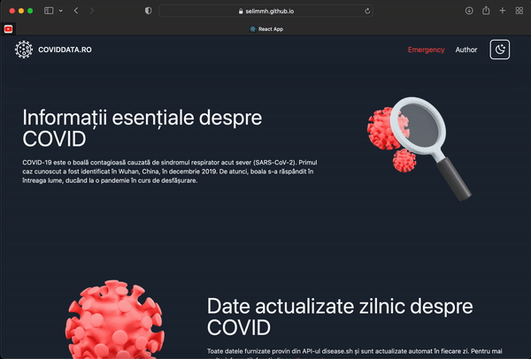

<!-- Title -->

# Romania's Covid Data with React

<!-- About -->

### About The Project

Covid Data using web tools. Check it out [Here](https://selimmh.github.io/coviddata-ro/)

#

### Preview

#

### Author Info

Hi 👋  
I am _Selim_

My website - [www.selimm.me](https://selimmh.me)  
Twitter - [@selimmh0](https://twitter.com/selimmh0)  
LinkedIn - [@selimmh](https://www.linkedin.com/in/selimmh/)  
E-mail - [[@selim.mht@gmail.com](https://mail.google.com/)

#

### Built With

- [React](https://reactjs.org)
- [TailwindCSS](https://tailwindcss.com)
- [Axios](https://axios-http.com)

#

### Important Dependencies

- [react-icons](https://github.com/react-icons/react-icons)
- [react-scroll](https://www.npmjs.com/package/react-scroll)

#

### API

- [disease.sh](https://www.disease.sh)

#
